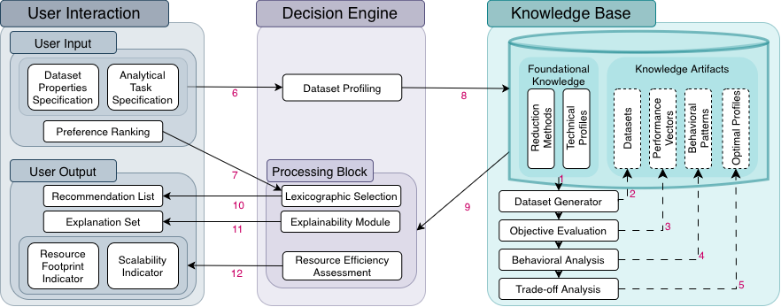

## This file shows the general architecture of CORTEXA

---

### Knowledge Base

We consider a representative set of reduction methods spanning vertical, horizontal, and hybrid paradigms. From their operational assumptions, we define a shared *technical profile space* capturing the key dataset statistical properties that condition reduction behaviour: presence of linear relationships, presence of normality in feature distributions, feature-type composition (numerical, categorical, or mixed), and dataset size (numbers of features and observations). The intended analytical task is also integrated, since some reduction techniques alter statistical properties in ways that affect task feasibility (1).

Each reduction method is assigned a *compatibility profile* specifying under which exact combinations of dataset properties and task types it can operate. Matching these profiles with the technical profile space yields a set of *feasible data configurations*. For each configuration, synthetic datasets are generated to enable systematic, unbiased evaluation (2). All compatible methods are applied to these datasets and evaluated along four objectives: performance preservation, reduction level, interpretability, and computational cost. The resulting performance vectors represent the behavioural signature of each method under specific data conditions and are stored in the Knowledge Base (3).

To extract higher-level behavioural structure, performance vectors are grouped through clustering in the multi-objective space, revealing recurrent behavioural profiles shared across different methods and data profiles. Within each cluster, methods are ranked by their frequency of occurrence, which reflects their behavioural stability across similar conditions. Finally, cluster representatives are filtered using Pareto dominance in order to retain only *non-dominated behavioural profiles*, preserving the essential trade-offs without imposing any a priori weighting between objectives (4).

### User Interaction

The User Interaction layer provides access to CORTEXA’s recommendation workflow through a graphical interface. Users specify the dataset context and rank the recommendations and the system returns a ranked list of reduction methods with concise visual and textual explanations directly linked to the inputs and learned behavioural profiles.

### Decision Engine

The Decision Engine constitutes the online core of CORTEXA. It aligns dataset characteristics, analytical-task requirements, and user priorities to generate context-aware and preference-consistent reduction-method recommendations.

At runtime, the engine receives the technical profile of the user’s dataset and the target analytical task (7). These descriptors define the operational context and are used to retrieve, from the Knowledge Base, only the reduction methods that are technically and analytically admissible (8). This ensures that all recommended methods are compatible with both the data and the task.

Users additionally specify an ordered set of priorities over the four core objectives. Preference ranking is performed through lexicographic selection over the Pareto-optimal behavioural profiles stored in the Knowledge Base (9), ensuring that higher-priority objectives strictly dominate lower-priority ones during selection. This enables transparent and preference-consistent trade-off resolution.

Once a preferred behavioural profile is selected, its associated reduction methods, ranked using their intra-cluster frequency, are displayed. The Decision Engine also integrates an explicability module that provides natural-language rationales and visual trade-off summaries (10).

The engine thus outputs a ranked and fully justified set of reduction-method recommendations grounded in empirical behavioural evidence and aligned with technical context and user-defined priorities.
