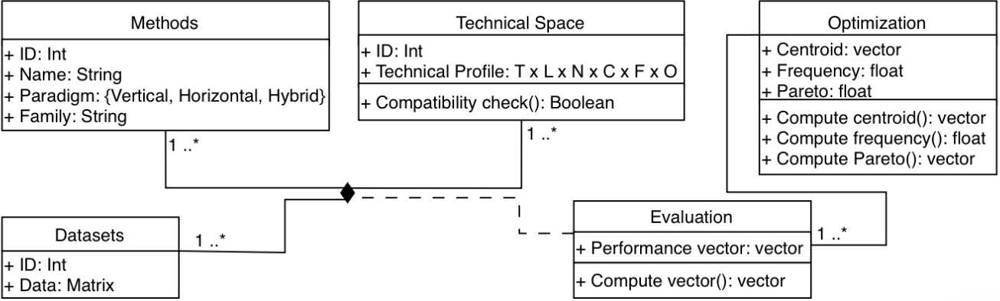

## This is the resulting structure of the knowledge base:

---

---

# Knowledge Base

The Knowledge Base constitutes the empirical foundation of CORTEXA. Its purpose is to capture, organize, and preserve knowledge regarding the behaviour of data reduction methods under different analytical contexts. This knowledge is subsequently exploited by the Decision Engine to support context-aware and preference-sensitive reduction-method selection.

The construction process corresponds to the offline phase of the framework and is illustrated by steps **(1)--(5)** in the system architecture.

## Knowledge Structure

The Knowledge Base is organized into three complementary layers:

### Source Knowledge

Source knowledge corresponds to the expert knowledge used to initiate the construction process:

* Dataset Profiles
* Reduction Methods
* Method Applicability Conditions
* Analytical Tasks
* Optimization Objectives

These elements define the problem space within which reduction methods are evaluated.

### Knowledge Artifacts

Knowledge artifacts correspond to the information generated during the construction process:

* Synthetic Benchmark Datasets
* Performance Vectors
* Behavioural Profiles
* Pareto-Optimal Profiles

Each artifact enriches the Knowledge Base with progressively higher levels of abstraction.

### Decision Knowledge

Decision knowledge corresponds to the final behavioural representations exploited during recommendation:

* Context-to-method compatibility relationships
* Behavioural trade-off profiles
* Pareto-optimal behavioural patterns
* Method occurrence frequencies

These elements constitute the knowledge consulted by the online Decision Engine.

---

# Knowledge Construction Process

## Step 1 — Context Definition and Synthetic Dataset Generation (1)

The construction process begins by defining a collection of dataset profiles representing distinct analytical contexts.

Each profile combines:

* analytical task
* relationship linearity
* distributional characteristics
* feature-type composition
* dataset dimensionality
* dataset scale

Together, these properties define a context vector describing the conditions under which reduction methods will be evaluated.

For every admissible context, synthetic benchmark datasets are generated. Synthetic generation was selected because it enables controlled manipulation of individual dataset properties while ensuring systematic coverage of the considered analytical space. This approach allows observed reduction behaviours to be attributed to known contextual conditions rather than uncontrolled characteristics of real-world datasets.

The generated datasets constitute the first category of knowledge artifacts stored within the Knowledge Base.

**Generated Artifact:** Synthetic Benchmark Datasets

---

## Step 2 — Compatibility Analysis (2)

In parallel with dataset generation, each reduction method is characterized through a technical profile describing its applicability conditions.

Examples of such constraints include:

* support for numerical or mixed-type features;
* minimum sample-size requirements;
* assumptions regarding linearity;
* compatibility with specific analytical tasks.

The framework subsequently compares every dataset profile with every reduction-method profile to determine admissible combinations.

This compatibility analysis prevents the evaluation of methods under inappropriate conditions and ensures methodological coherence throughout the construction process.

The resulting compatibility relationships are stored as knowledge describing which methods can legitimately be considered under each analytical context.

**Generated Artifact:** Context–Method Compatibility Map

---

## Step 3 — Multi-Objective Behavioural Evaluation (3)

For every compatible pair consisting of a dataset context and a reduction method, the reduction process is executed and evaluated.

Each reduction method is assessed according to the four optimization objectives considered in CORTEXA:

1. Predictive-Performance Preservation
2. Reduction Effectiveness
3. Interpretability
4. Computational Efficiency

The resulting objective values are normalized and combined into a performance vector describing the observed behaviour of the method within the considered analytical context.

Performance vectors constitute the empirical observations from which behavioural knowledge is derived.

They represent the fundamental evidence layer of the Knowledge Base and provide a quantitative description of reduction-method trade-offs.

**Generated Artifact:** Performance Vectors

---

## Step 4 — Behavioural Pattern Discovery (4)

The collection of performance vectors is subsequently analysed to identify recurrent behavioural structures.

Rather than analysing individual reduction outcomes independently, CORTEXA groups performance vectors exhibiting similar objective characteristics through clustering within the multi-objective space.

Each resulting cluster represents a behavioural profile corresponding to a recurring trade-off pattern.

Examples include profiles favouring:

* predictive performance,
* interpretability,
* aggressive reduction,
* computational efficiency,
* balanced compromises.

For every behavioural profile, the frequency of occurrence of each reduction method is recorded. These frequencies provide information regarding the stability and robustness of methods under similar analytical conditions.

This abstraction process transforms large collections of individual observations into higher-level behavioural knowledge.

**Generated Artifact:** Behavioural Profiles

---

## Step 5 — Trade-Off Optimization and Decision Knowledge Extraction (5)

The final construction stage identifies the behavioural profiles that provide the most efficient compromises among the optimization objectives.

Each behavioural profile is represented by a centroid summarizing its characteristic objective values.

The centroids are then compared using Pareto dominance analysis.

A behavioural profile is discarded whenever another profile performs at least as well on every objective and strictly better on at least one objective. Such profiles do not provide any advantage under any possible objective-priority configuration.

The remaining profiles constitute the Pareto-optimal behavioural layer of the Knowledge Base.

These profiles preserve the intrinsic trade-offs observed during evaluation while eliminating redundant solutions.

Together with their associated method frequencies and compatibility information, they form the final decision knowledge exploited by the online recommendation process.

**Generated Artifacts:**

* Pareto-Optimal Behavioural Profiles
* Method Frequencies
* Decision Knowledge

---

# Resulting Knowledge Base

Upon completion of the offline phase, the Knowledge Base contains:

## Source Knowledge

* Dataset Profiles
* Reduction Methods
* Applicability Conditions
* Analytical Tasks
* Optimization Objectives

## Generated Knowledge Artifacts

* Synthetic Benchmark Datasets
* Context–Method Compatibility Relationships
* Performance Vectors
* Behavioural Profiles
* Pareto-Optimal Profiles
* Method Frequencies

## Decision Knowledge

* Context-aware behavioural trade-offs
* Efficient reduction-method profiles
* Preference-independent recommendation knowledge

These elements collectively provide the empirical foundation that enables CORTEXA to generate transparent, context-aware, and preference-sensitive reduction-method recommendations.
