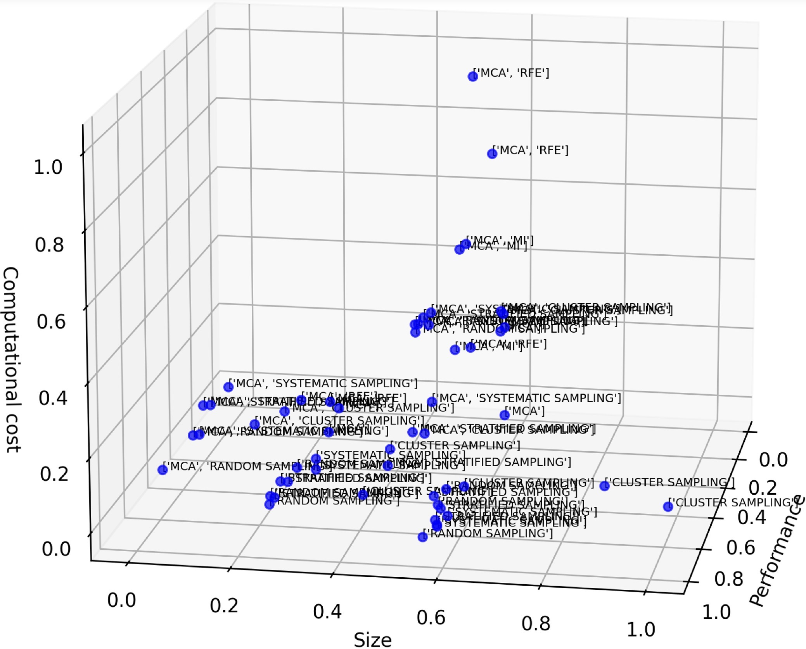
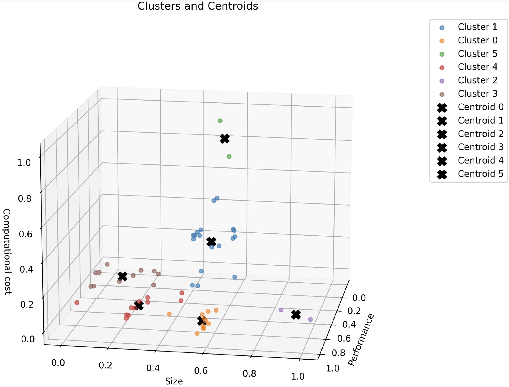
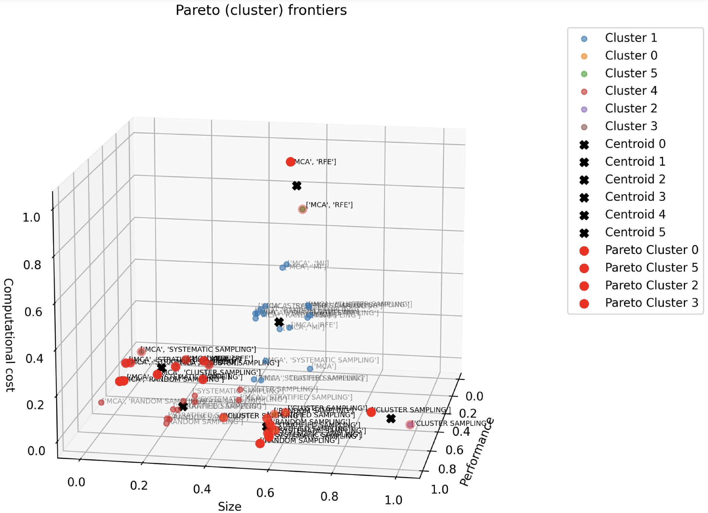

# Behavioural Pattern Analysis

## Purpose

The evaluation phase produces a large collection of performance vectors describing the behaviour of reduction methods under different analytical contexts. Each vector represents the observed performance of a reduction method with respect to the four optimisation objectives considered in CORTEXA:

* Predictive performance preservation
* Reduction effectiveness
* Interpretability
* Computational efficiency

Because hundreds of vectors may be generated for a single dataset profile, directly analysing individual observations would be difficult and would provide limited decision-support value. The objective of the behavioural-pattern analysis phase is therefore to transform these raw observations into higher-level knowledge structures that can be reused during recommendation.

This transformation is performed in three stages:

1. Behavioural pattern identification through clustering.
2. Trade-off optimisation through Pareto analysis.
3. Stability assessment through frequency analysis.

---

# 1. Behavioural Pattern Identification

## Why Behavioural Patterns?

Different reduction methods often exhibit similar trade-off behaviours even when they are not identical algorithms.

For example:

* Several feature-selection methods may preserve predictive performance while providing high interpretability.
* Multiple sampling techniques may achieve similar computational savings.
* Different hybrid strategies may produce nearly identical objective profiles.

Treating each observation independently would therefore introduce substantial redundancy into the knowledge base.

The objective is not to identify individual methods but rather to identify recurring behavioural regimes that characterise how reduction methods behave under specific conditions.

---

## Why Clustering?

A simple aggregation strategy based on averages was considered but rejected.

Averages provide only a global summary of observed outcomes and ignore the existence of distinct behavioural groups.

For example, if half of the methods favour predictive performance while the other half favour computational efficiency, averaging their objective values would produce an artificial profile that corresponds to no actual reduction strategy.

Clustering preserves this diversity by identifying groups of observations that exhibit similar objective trade-offs.

This allows the knowledge base to represent multiple valid reduction behaviours instead of collapsing them into a single average profile.

---

## Clustering Process

Each performance vector is represented as a point in the multi-objective space:

$$
\mathbf{z} =
(z_{perf},
z_{red},
z_{int},
z_{cost})
$$

where:

* (z_{perf}) = predictive performance
* (z_{red}) = reduction effectiveness
* (z_{int}) = interpretability
* (z_{cost}) = computational efficiency

Vectors exhibiting similar objective values are grouped into clusters.

Each cluster represents a behavioural pattern corresponding to a recurring trade-off structure observed across reduction methods and datasets.

The centroid of each cluster is subsequently used as a compact representation of the associated behaviour.

---

## Figure 1 – Raw Performance Vectors

This figure illustrates the diversity of observed reduction behaviours before behavioural analysis.
Each point represents a performance vector in a three dimensional space, because a four dimentional vizualization would have been impossible.

---

## Figure 2 – Identified Behavioural Patterns

Next, the vectors are clusters in order to identify behavioural patters.

Each colour represents a distinct behavioural pattern identified through clustering.

---

# 2. Pareto-Based Trade-off Optimisation

## Why Pareto Analysis?

Once behavioural patterns have been identified, not all of them remain useful for decision support.

Some patterns are clearly inferior to others.

For example, consider two behavioural patterns:

| Pattern | Performance | Reduction | Interpretability | Cost |
| ------- | ----------- | --------- | ---------------- | ---- |
| A       | High        | High      | Medium           | High |
| B       | Medium      | Medium    | Medium           | High |

Pattern B provides no advantage over Pattern A.

Regardless of user priorities, Pattern A would always be preferred.

Keeping such dominated patterns would unnecessarily increase the complexity of the recommendation process.

---

## Why Not Weighted Aggregation?

Weighted aggregation techniques require objective weights to be specified in advance.

However, CORTEXA is designed to support users with different priorities.

A profile that is optimal for one user may not be optimal for another.

Using fixed weights during knowledge-base construction would therefore introduce an arbitrary preference structure before the user has expressed any preferences.

Pareto optimisation avoids this problem.

It preserves all efficient trade-offs without imposing any predefined objective importance.

---

## Pareto Dominance

A behavioural pattern is considered dominated if another pattern performs at least as well on all objectives and strictly better on at least one objective.

Dominated patterns are removed.

The remaining patterns form the Pareto frontier.

These profiles represent efficient trade-offs for which improvement on one objective necessarily requires sacrificing at least one other objective.

---

## Figure 3 – Pareto-Optimal Behavioural Patterns

The highlighted points correspond to behavioural patterns retained in the final knowledge base.

These profiles represent the set of efficient trade-offs available for future recommendations.

---

# 3. Frequency Analysis

## Why Frequency Matters

Pareto optimality identifies efficient trade-offs but does not indicate whether these trade-offs occur consistently.

Two behavioural patterns may both be Pareto optimal while exhibiting very different levels of stability.

For example:

* One pattern may appear hundreds of times across multiple datasets and reduction methods.
* Another pattern may appear only once.

The first pattern represents a stable and recurring behaviour, whereas the second may correspond to a highly specific situation.

---

## Frequency Computation

For each behavioural pattern, the frequency of occurrence of each reduction method is recorded.

The frequency represents the number of times a method contributes to a given behavioural pattern across all evaluated contexts.

This information provides an additional measure of robustness and consistency.

---

## Why Frequency Is Stored

Frequency information supports several decision-support functions:

* Identification of stable reduction behaviours.
* Detection of methods that repeatedly appear within efficient trade-off regions.
* Generation of confidence indicators for recommendations.
* Explainability of recommendation results.

A recommendation supported by a behavioural pattern observed repeatedly across many contexts is generally more reliable than one supported by a rarely observed pattern.

---

# Resulting Knowledge Artifacts

The behavioural analysis phase produces four knowledge artifacts:

1. Performance vectors.
2. Behavioural patterns (clusters).
3. Pareto-optimal behavioural profiles.
4. Method-frequency statistics.

Together, these artifacts transform raw experimental observations into reusable decision knowledge that can subsequently be exploited by the online recommendation engine.
