# Classification Experimentation

## Experimental Setup and Results

Experiments were conducted to evaluate the system's performance on the following objectives:

* **Task 1:** Ensure exhaustive coverage of the system's defined technical scenarios.
* **Task 2:** Demonstrate the cross-domain generalizability of the approach through its application to heterogeneous datasets.
* **Task 3:** Empirically assess the pertinence of the generated reduction recommendations in terms of technical compatibility, reduction effectiveness, interpretability, computational efficiency, and predictive-performance preservation.

---

## Datasets

Seven real-world datasets were selected from diverse application domains in order to evaluate the decision-support system under realistic conditions.

| Dataset                       | Domain         |
| ----------------------------- | -------------- |
| Heart Attack Prediction       | Healthcare     |
| Hotel Booking Demand          | Tourism        |
| California Housing            | Social Studies |
| Company Bankruptcy Prediction | Finance        |
| Mushroom Classification       | Agriculture    |
| Boston House Pricing          | Real Estate    |
| Students Performance          | Education      |

### Dataset Sources

* Heart Attack Prediction: https://www.kaggle.com/datasets/juledz/heart-attack-prediction
* Hotel Booking Demand: https://www.kaggle.com/datasets/jessemostipak/hotel-booking-demand
* California Housing: https://www.kaggle.com/datasets/camnugent/california-housing-prices
* Company Bankruptcy Prediction: https://www.kaggle.com/datasets/fedesoriano/company-bankruptcy-prediction
* Mushroom Classification: https://www.kaggle.com/datasets/uciml/mushroom-classification
* Boston House Pricing: https://www.kaggle.com/datasets/fedesoriano/the-boston-houseprice-data
* Students Performance: https://www.kaggle.com/datasets/spscientist/students-performance-in-exams

---

## Evaluation Scenarios

The online evaluation serves two complementary objectives:

1. Assess whether the recommendations generated by CORTEXA remain consistent with the technical requirements imposed by dataset characteristics.
2. Verify that recommended reduction methods preserve predictive quality while providing meaningful reductions under diverse statistical and structural conditions.

Each dataset was mapped to one of the admissible dataset profiles defined in the technical space. These profiles combine linearity assumptions, normality conditions, feature-type composition, dataset scale, and user priorities.

### Scenario Definitions

| ID | Dataset                       | Domain         | L   | N   | C           | F     | O     | Priority Order                                    |
| -- | ----------------------------- | -------------- | --- | --- | ----------- | ----- | ----- | ------------------------------------------------- |
| H  | Heart Attack Prediction       | Healthcare     | Yes | No  | Mixed       | Small | Small | Reduction → Interpretability → Performance → Cost |
| T  | Hotel Booking Prediction      | Tourism        | No  | No  | Mixed       | Big   | Big   | Cost → Performance → Reduction → Interpretability |
| S  | Housing                       | Social Studies | Yes | Yes | Numerical   | Small | Big   | Performance → Cost → Reduction → Interpretability |
| F  | Company Bankruptcy Prediction | Finance        | No  | No  | Numerical   | Big   | Big   | Performance → Cost → Reduction → Interpretability |
| A  | Mushroom Classification       | Agriculture    | No  | No  | Categorical | Big   | Big   | Cost → Performance → Reduction → Interpretability |
| R  | Boston House Pricing          | Real Estate    | Yes | No  | Numerical   | Small | Small | Performance → Interpretability → Reduction → Cost |
| E  | Students Performance          | Education      | Yes | Yes | Mixed       | Small | Small | Reduction → Performance → Interpretability → Cost |

Where:

* **L** = Linearity
* **N** = Normality
* **C** = Feature composition
* **F** = Feature-scale category
* **O** = Observation-scale category

---

## User Priority Structures

To approximate realistic decision-making conditions, each dataset was associated with a priority ordering reflecting the objectives typically emphasized in its application domain.

Examples include:

* Healthcare applications favouring interpretability and reduction.
* Financial applications prioritising predictive performance.
* Operational domains emphasising computational efficiency.
* Educational analytics balancing reduction effectiveness and predictive quality.

These priorities are supplied to the Decision Engine and determine the lexicographic ranking applied during recommendation generation.

---

## Results

For each dataset, the first row corresponds to the baseline model trained on unreduced data. The subsequent rows present the reduction methods recommended by CORTEXA, ranked according to the user-defined objective priorities.

---

---

## Analysis of Results By Scenario
This file contains the analysis of the results obtained after the evaluation step by scenario.

## Experimental Setup and Results

Experiments were conducted to evaluate the system's performance on the following task:

- [Task 1: ensure exhaustive coverage of the system's defined technical scenarios]
- [Task 2: demonstrate the cross-domain generalizability of our approach through its application to heterogeneous datasets]
- [Task 3: empirically assess the pertinence of the generated reduction suggestions, both in terms of alignment with technical compatibility and preservation of task-specific performance]

### 1. Healthcare \& Medical Diagnostics 

Dataset: [Heart Attack Prediction](https://www.kaggle.com/datasets/juledz/heart-attack-prediction)

Priority Order: Reduced size → Interpretability → Performance → Computational cost
- In medical contexts, datasets often involve high-dimensional patient data. Reduced size is prioritized to improve model robustness and mitigate overfitting.
- Interpretability is crucial because clinicians must understand and trust model decisions, especially in high-stakes scenarios.
- While performance is important, it’s acceptable to slightly compromise accuracy for transparency.
- Computational cost is less critical due to access to hospital infrastructure or cloud computing.

#### Obtained Results

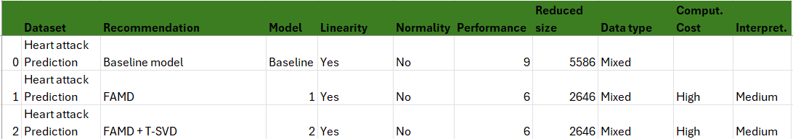

#### Technical Compatibility with the Reduction Techniques

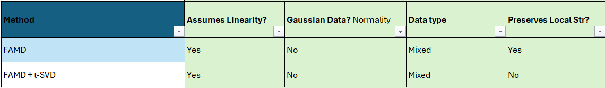

#### Priority Compatibility

1. Reduced size - Retained Options:
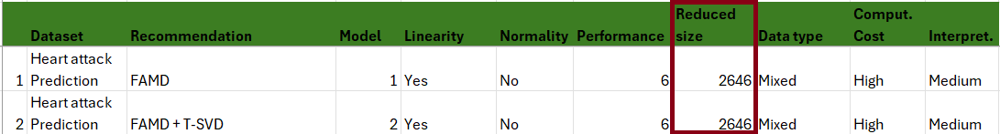   
2. Interpretability - Retained Options:
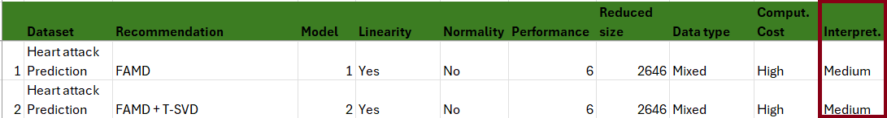   
3. Performance - Retained Options:
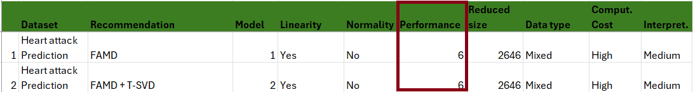   
4. Computational cost - Retained Options:
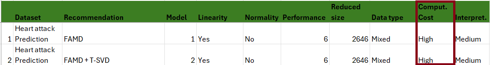

#### Result Analysis

As we can observe in these tables, the two options displayed the same results. That is explained by the fact that when executiong option two, T-SVD failed after FAMD. This can be due to:
 - insufficient domain related configuration
 - FAMD can output NaNs or infinite values, if normalization fails due to 0 variance
 - Missing values, from categories with low variance

##### If T-SVD failed to perform, why do we still have it as an option ? 

The retained options  have the same performance profile, even if T-SVD failed. Both solutions were selected from Pareto efficient clusters. 

#### Conclusion 

These results resulted in several conclusions:

1. The recommendations retained by our solution correspond to the technical profile and the analytical task of the user.
2. We were not able to conclude on the level of compatibility with the ranked priorities of the user.
3. The second helped us identify several limits of our solution:

   3.1. Missiong domain-knowledge

   3.2. Insufficient implementations

   3.3. Insufficient personalization of the Reduction Techniques in an objective of better compqtibility with the compatible Reduction Techniques (the permutations couples)
   
---

### 2. Tourism \& Hospitality Management 

Dataset: [Hotel Booking](https://www.kaggle.com/datasets/jessemostipak/hotel-booking-demand)

Priority Order: Computational cost → Performance → Reduced size → Interpretability
- In hospitality systems (e.g., booking platforms), fast and cost-efficient decisions are essential for handling large volumes of user requests in real-time.
- Performance matters for ensuring booking accuracy and user satisfaction.
- Reduced size is secondary, useful for reducing latency.
- Interpretability is less crucial as decisions affect revenue but not human health or safety.

#### Obtained Results

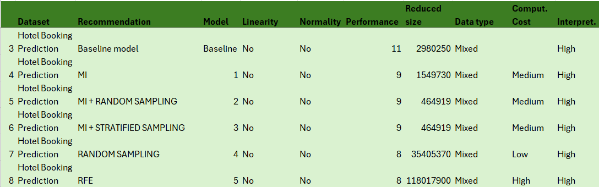

#### Technical Compatibility with the Reduction Techniques

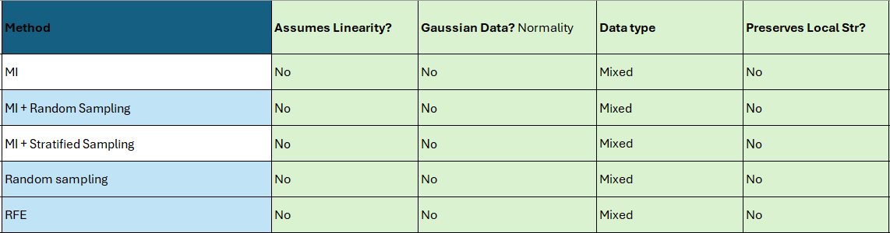

#### Priority Compatibility

1. Computational cost - Retained Options:
   
2. Performance - Retained Options:
   
3. Reduced size - Retained Options:
   
4. Interpretability - Retained Options:

---

### 3. Sociodemographic Studies \& Public Policy 

Dataset: [Housing](https://www.kaggle.com/datasets/camnugent/california-housing-prices)

Priority Order: Performance → Computational cost → Reduced size → Interpretability 
- In policy-making, accurate prediction or classification of social phenomena is central for resource allocation and planning.
- Computational cost is considered because these studies often use large government datasets.
- Reduced size is valued to ensure feasibility on standard infrastructure.
- Interpretability is less critical as decisions are aggregated and not made at the individual level.

#### Obtained Results

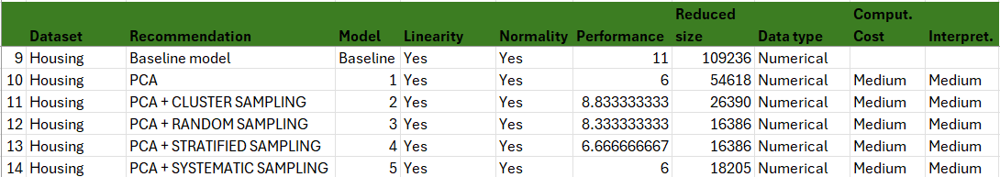

#### Technical Compatibility with the Reduction Techniques

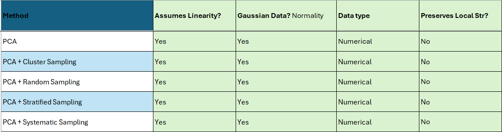

#### Priority Compatibility

1. Performance - Retained Options:
   
2. Computational cost - Retained Options:
   
3. Reduced size - Retained Options:
   
4. Interpretability - Not Necessary:
   
   

---

### 4. Finance \& Risk Management 

[Company Bankruptcy Prediction](https://www.kaggle.com/datasets/fedesoriano/company-bankruptcy-prediction)

Priority Order: Performance → Computational cost → Reduced size → Interpretability 
- Financial systems require high-performing models for forecasting, fraud detection, and risk assessment.
- Computational efficiency is vital due to the volume and velocity of financial data.
- Reduced size improves real-time applicability.
- While interpretability is helpful (e.g., for regulatory compliance), it often takes a back seat to predictive accuracy in trading and risk scenarios.

#### Obtained Results

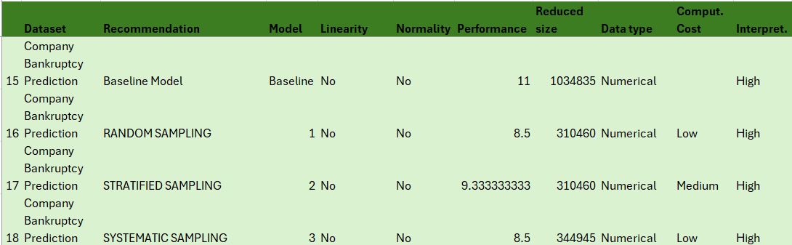

#### Technical Compatibility with the Reduction Techniques

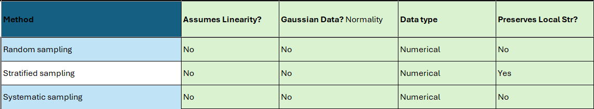

#### Priority Compatibility

1. Performance - Retained Options:
   
2. Computational cost - Retained Options:
   
3. Reduced size - Retained Options:
   
4. Interpretability - Not Necessary:
   
   
---

### 5. Agriculture \& Food Safety 

[Mushrooms Classification](https://www.kaggle.com/datasets/uciml/mushroom-classification)

Priority Order: Computational cost → Performance → Reduced size → Interpretability 
- In field-based applications, computational efficiency is a priority due to the use of edge devices (e.g., sensors, drones).
- Performance is key for real-time classification (e.g., plant health, mushroom edibility).
- Reduced size supports deployment on lightweight systems.
- Interpretability is useful but not mission-critical for automated decisions.

#### Obtained Results

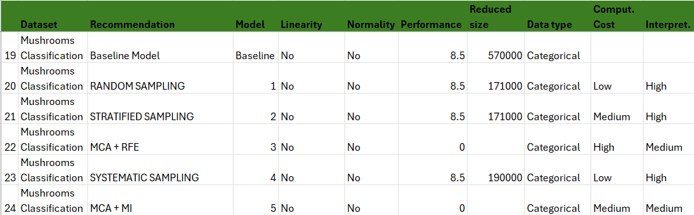

#### Technical Compatibility with the Reduction Techniques

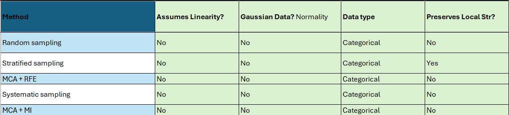

#### Priority Compatibility

1. Computational Cost - Retained Options:
   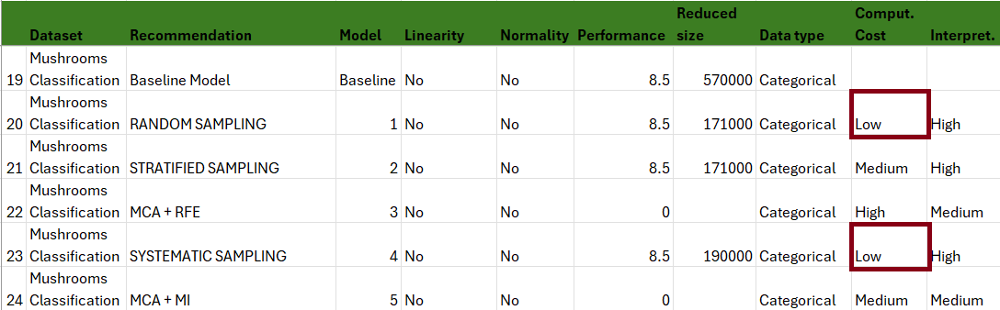
3. Performance - Retained Options:
   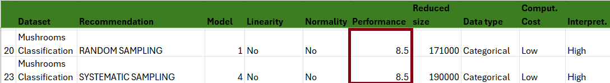
5. Reduced size - Retained Options: 
   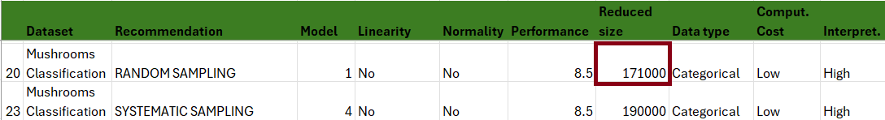
7. Interpretability - Not Necessary, as we have alreary obtained one option at the precedent level
---

### 6. Urban Planning \& Real Estate Economics 

[Boston House Pricing](https://www.kaggle.com/datasets/fedesoriano/the-boston-houseprice-data)

Priority Order: Performance → Interpretability → Reduced size → Computational cost 
- Here, performance is necessary to provide reliable estimates for housing policies or economic forecasts.
- Interpretability is important to justify decisions to public officials or stakeholders.
- Reduced size supports usability across different municipalities.
- Computational cost is typically not a limiting factor, as analysis can be done offline.

#### Obtained Results

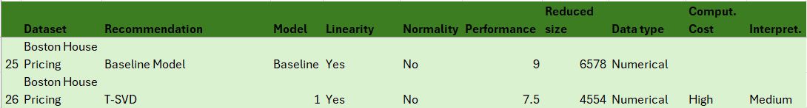

#### Technical Compatibility with the Reduction Techniques

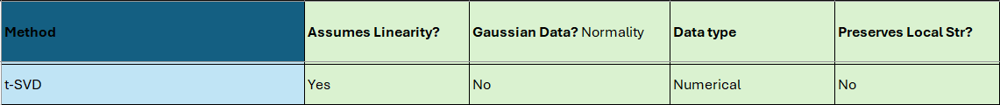

#### Priority Compatibility

We have obtained only one recommendation that is compatible with the statistical properties of the dataset. This means that only one reduction strategy has satisfied the technical constraints and has an optimal distribution of the values of the criteria for priorization.
In this context, it is irrelevant to search for priority compatibility.

---

### 7. Education \& Academic Analytics 

[Students Performance](https://www.kaggle.com/datasets/spscientist/students-performance-in-exams)

Priority Order: Reduced size → Performance → Interpretability → Computational cost 
- In academic research, smaller datasets are easier to collect, share, and analyze across institutions.
- Performance ensures valid predictions of student outcomes.
- Interpretability helps explain model decisions to educators or policymakers.
- Computational cost is generally low-priority in academic settings, where time and resources are more flexible.

#### Obtained Results

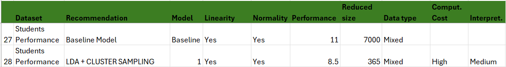

#### Technical Compatibility with the Reduction Techniques

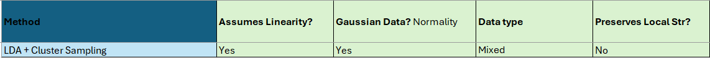

#### Priority Compatibility

We have obtained only one recommendation that is compatible with the statistical properties of the dataset. This means that only one reduction strategy has satisfied the technical constraints and has an optimal distribution of the values of the criteria for priorization.
In this context, it is irrelevant to search for priority compatibility.

---

## Discussion

The evaluation confirms three important properties of CORTEXA.

### Technical Coherence

All recommended methods satisfy the compatibility constraints associated with the corresponding dataset profiles. No recommendation violates the assumptions encoded in the method profiles stored within the Knowledge Base.

### Cross-Domain Generalisation

The system successfully generates recommendations across heterogeneous domains including healthcare, tourism, finance, agriculture, education, social studies, and real estate. This demonstrates that recommendations depend on dataset characteristics rather than application domain.

### Preference Sensitivity

Recommendations vary according to the priority ordering specified by the user. Datasets emphasising computational efficiency favour sampling-based reductions, whereas performance-oriented scenarios favour dimensionality-reduction and feature-selection techniques. This behaviour confirms that preference-based decision making is performed explicitly during the online phase rather than being hard-coded during Knowledge Base construction.

Overall, the results demonstrate that CORTEXA produces context-aware recommendations that remain technically valid, align with user priorities, and preserve predictive quality while achieving meaningful dataset reduction.
